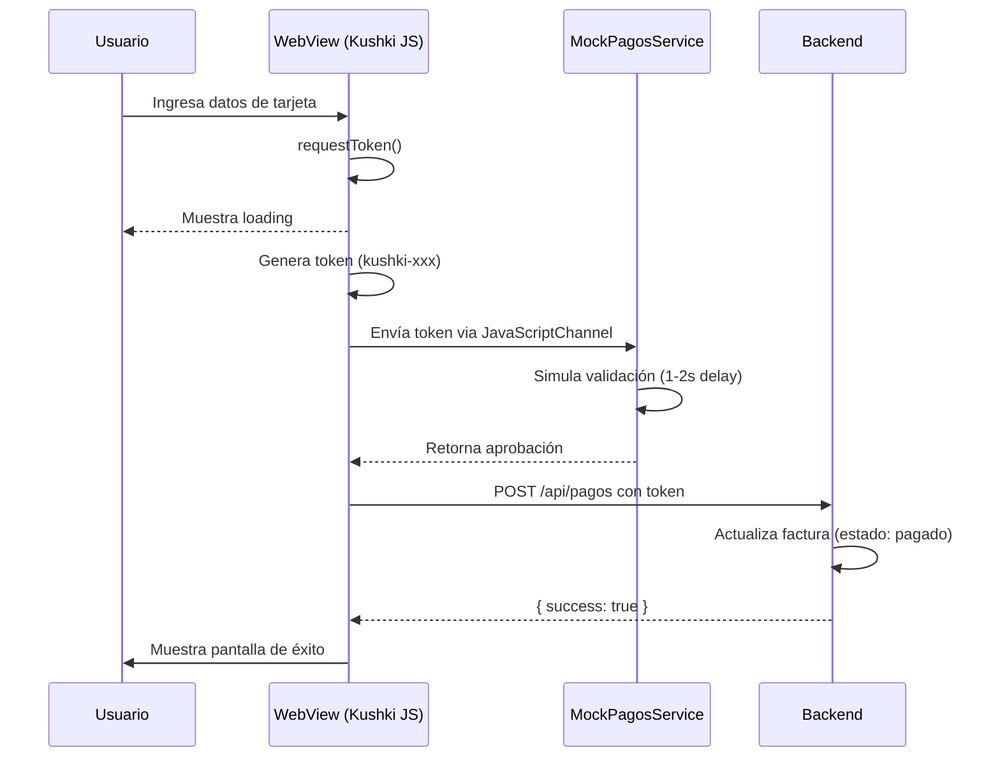

# DOCUMENTACIÓN TÉCNICA DEL FRONTEND
## Sistema de Comercio Electrónico - TechResources


---

## 1. DESCRIPCIÓN GENERAL DEL FRONTEND

### 1.1 Propósito y Alcance

El frontend del proyecto **TechResources** es una **aplicación móvil multiplataforma** desarrollada en **Flutter/Dart** que simula un sistema completo de comercio electrónico B2B (Business-to-Business). El objetivo principal de esta aplicación es **demostrar capacidades técnicas de frontend** mediante la implementación de flujos de negocio reales, incluyendo:

- **Catálogo de productos** con búsqueda y categorización
- **Gestión de carrito de compras** con validación de stock en tiempo real
- **Proceso de checkout** con validación de datos fiscales y direcciones de envío
- **Generación automática de facturas** electrónicas
- **Sistema de pagos simulado** con tarjeta de crédito (Kushki Sandbox)
- **Gestión de crédito** empresarial con visualización de cupos y saldos
- **Historial de facturas y pagos** con filtros y búsquedas
- **Sistema de favoritos** para productos
- **Notificaciones Push** con Firebase Cloud Messaging
- **Panel administrativo** con estadísticas y gestión

### 1.2 Rol del Frontend en el Sistema

El frontend actúa como **cliente HTTP** que consume una **API REST simulada** alojada en un backend Node.js/Express. El backend **no contiene lógica de negocio real**, sino que sirve como **proveedor de datos estructurados** para permitir que el frontend funcione con información persistente.

**Características clave:**
- ✅ El frontend implementa **toda la lógica de presentación y navegación**
- ✅ El backend provee endpoints REST para operaciones CRUD básicas
- ✅ El flujo de pago con tarjeta es **completamente simulado** usando Kushki Sandbox (modo de prueba)
- ✅ La aplicación está diseñada para **demostrar competencias técnicas en desarrollo móvil**

### 1.3 Plataformas Soportadas

| Plataforma | Estado | Observaciones |
|-----------|--------|---------------|
| **Android** | ✅ Soportado | Completamente funcional |
| **iOS** | ✅ Soportado | Completamente funcional |
| **Web** | ⚠️ Limitado | Sin WebView (pagos) ni notificaciones push |
| **macOS** | ✅ Soportado | Funcional con WebView |
| **Windows** | ⚠️ Limitado | Sin notificaciones push |
| **Linux** | ⚠️ Limitado | Sin notificaciones push |

---

## 2. TECNOLOGÍAS Y LIBRERÍAS UTILIZADAS

### 2.1 Framework Principal

| Tecnología | Versión | Descripción |
|-----------|---------|-------------|
| **Flutter SDK** | 3.10.1+ | Framework multiplataforma de Google para desarrollo de UI nativas |
| **Dart** | 3.10.1+ | Lenguaje de programación optimizado para UI |

### 2.2 Dependencias Principales

#### **Estado y Gestión de Datos**
```yaml
provider: ^6.1.2  # Gestión de estado reactivo (arquitectura MVVM)
```

#### **Networking y API**
```yaml
http: ^1.2.0  # Cliente HTTP para consumo de API REST
```

#### **Firebase Services**
```yaml
firebase_core: ^4.3.0         # Inicialización de Firebase
firebase_messaging: ^16.1.0   # Notificaciones Push (FCM)
```

#### **Almacenamiento Local**
```yaml
shared_preferences: ^2.3.3  # Persistencia de datos simples (tokens, preferencias)
path_provider: ^2.1.5       # Acceso a directorios del sistema
gal: ^2.3.0                 # Acceso a galería de imágenes
permission_handler: ^11.3.1 # Manejo de permisos nativos
```

#### **UI/UX Components**
```yaml
flutter_svg: ^2.0.10+1           # Renderizado de imágenes SVG
intl: ^0.20.2                    # Internacionalización y formateo (fechas, moneda)
webview_flutter: ^4.13.1         # WebView para integración Kushki JS SDK
percent_indicator: ^4.1.1        # Indicadores visuales de progreso
flutter_local_notifications: ^19.5.0  # Notificaciones locales
share_plus: ^10.0.0              # Compartir archivos (comprobantes)
```

#### **Localización**
```yaml
flutter_localizations: (SDK)  # Soporte para localización en español (es_ES)
```

### 2.3 Herramientas de Desarrollo

```yaml
dev_dependencies:
  flutter_test: (SDK)              # Testing unitario
  flutter_lints: ^6.0.0            # Análisis estático de código
  flutter_launcher_icons: ^0.14.4  # Generación de iconos de app
```

---

## 3. ARQUITECTURA DEL FRONTEND

### 3.1 Patrón Arquitectónico: MVVM con Provider

La aplicación sigue el patrón **Model-View-ViewModel (MVVM)** implementado mediante la librería **Provider** de Flutter.

```
┌─────────────────────────────────────────────────────────┐
│                    PRESENTATION LAYER                    │
│  ┌──────────────────────────────────────────────────┐  │
│  │            WIDGETS (Views)                        │  │
│  │  - Screens, Pages, Components                    │  │
│  │  - StatefulWidget / StatelessWidget              │  │
│  └──────────────────────────────────────────────────┘  │
│                         ▲                               │
│                         │ consume                       │
│                         │                               │
│  ┌──────────────────────▼───────────────────────────┐  │
│  │         SERVICES (ViewModels)                     │  │
│  │  - ChangeNotifier (Provider)                      │  │
│  │  - Lógica de negocio                             │  │
│  │  - Gestión de estado                             │  │
│  └──────────────────────────────────────────────────┘  │
│                         ▲                               │
│                         │ usa                           │
│                         │                               │
│  ┌──────────────────────▼───────────────────────────┐  │
│  │              MODELS (Data)                        │  │
│  │  - Clases Dart con fromJson/toJson              │  │
│  │  - Entidades de dominio                          │  │
│  └──────────────────────────────────────────────────┘  │
└─────────────────────────────────────────────────────────┘
                          ▲
                          │ HTTP
                          │
┌─────────────────────────▼───────────────────────────────┐
│                    API SERVICE                           │
│  - ApiService (Singleton)                               │
│  - Gestión de tokens JWT                               │
│  - Endpoints REST                                       │
└─────────────────────────────────────────────────────────┘
                          ▲
                          │ HTTP
                          │
┌─────────────────────────▼───────────────────────────────┐
│                  BACKEND (Node.js/Express)              │
│  - API REST simulada                                    │
│  - Base de datos PostgreSQL                             │
└─────────────────────────────────────────────────────────┘
```

### 3.2 Ventajas del Patrón Implementado

| Ventaja | Descripción |
|---------|-------------|
| **Separación de responsabilidades** | Las vistas no contienen lógica de negocio |
| **Reactividad automática** | Provider notifica cambios a los widgets suscritos |
| **Testabilidad** | Los servicios pueden testearse independientemente |
| **Reutilización** | Los servicios son compartidos globalmente mediante MultiProvider |
| **Escalabilidad** | Fácil agregar nuevas features sin afectar el código existente |

### 3.3 Flujo de Datos

```dart
// 1. Widget solicita datos
Consumer<ProductosService>(
  builder: (context, productosService, child) {
    return ListView.builder(...);
  }
)

// 2. Service notifica cambios
class ProductosService extends ChangeNotifier {
  Future<void> fetchProductos() async {
    _productos = await _apiService.getProductos();
    notifyListeners(); // ✅ Notifica a todos los widgets escuchando
  }
}

// 3. API Service realiza petición HTTP
class ApiService {
  Future<List<Producto>> getProductos() async {
    final response = await http.get('$baseUrl/productos');
    return (jsonDecode(response.body) as List)
        .map((json) => Producto.fromJson(json))
        .toList();
  }
}
```

---

## 4. ESTRUCTURA DE CARPETAS Y EXPLICACIÓN

```
lib/
│
├── main.dart                    # ⚙️ Punto de entrada de la aplicación
├── firebase_options.dart        # 🔥 Configuración Firebase (autogenerado)
│
├── core/                        # 🧰 Núcleo compartido de la app
│   ├── services/                # 📡 Servicios globales (ViewModels)
│   │   ├── api_service.dart         # HTTP Client + Endpoints REST
│   │   ├── auth_service.dart        # Gestión de autenticación
│   │   ├── carrito_service.dart     # Lógica del carrito
│   │   ├── productos_service.dart   # Catálogo de productos
│   │   ├── facturas_service.dart    # Gestión de facturas
│   │   ├── pagos_service.dart       # Procesamiento de pagos
│   │   ├── favoritos_service.dart   # Lista de favoritos
│   │   ├── theme_service.dart       # Tema claro/oscuro
│   │   ├── navigation_service.dart  # Navegación global
│   │   ├── firebase_messaging_service.dart  # Push notifications
│   │   ├── datos_facturacion_service.dart   # Datos fiscales
│   │   ├── direcciones_envio_service.dart   # Direcciones
│   │   ├── mock_pagos_service.dart  # Servicio Mock de pagos
│   │   ├── ipagos_service.dart      # Interfaz de pagos
│   │   └── payment_receipt_service.dart  # Generación de comprobantes
│   │
│   ├── logs/                    # 📝 Sistema de logging
│   │   └── app_logger.dart          # Logger profesional
│   │
│   ├── models/                  # 📦 Modelos compartidos (si aplica)
│   └── widgets/                 # 🎨 Widgets reutilizables globales
│
├── models/                      # 📊 Modelos de datos (Entidades)
│   ├── producto.dart                # Modelo de Producto
│   ├── carrito_item.dart            # Item del carrito
│   ├── factura.dart                 # Modelo de Factura
│   ├── detalle_factura.dart         # Detalle de factura
│   ├── pago.dart                    # Modelo de Pago
│   ├── cliente.dart                 # Modelo de Cliente
│   ├── pedido.dart                  # Modelo de Pedido
│   ├── categoria.dart               # Modelo de Categoría
│   ├── datos_facturacion.dart       # Datos fiscales
│   ├── direccion_envio.dart         # Dirección de envío
│   └── receipt_data.dart            # Datos del comprobante
│
├── features/                    # 🎯 Módulos por funcionalidad (Feature-based)
│   ├── auth/                        # Autenticación
│   │   └── screens/
│   │       └── login_tab.dart
│   │
│   ├── productos/                   # Catálogo de productos
│   │   ├── screens/
│   │   │   ├── productos_tab.dart
│   │   │   └── producto_detalle_screen.dart
│   │   └── widgets/
│   │
│   ├── carrito/                     # Carrito de compras
│   │   ├── screens/
│   │   │   ├── carrito_screen.dart
│   │   │   └── checkout_screen.dart
│   │   └── widgets/
│   │
│   ├── facturas/                    # Gestión de facturas
│   │   ├── screens/
│   │   │   └── facturas_tab.dart
│   │   └── widgets/
│   │
│   ├── pagos/                       # Procesamiento de pagos
│   │   └── screens/
│   │       └── pago_tarjeta_page.dart
│   │
│   ├── credito/                     # Gestión de crédito empresarial
│   │   └── screens/
│   │       └── credito_tab.dart
│   │
│   ├── favoritos/                   # Lista de favoritos
│   │   └── screens/
│   │       └── favoritos_screen.dart
│   │
│   ├── cuenta/                      # Perfil de usuario
│   │   └── screens/
│   │       └── mi_cuenta_screen.dart
│   │
│   ├── datos_facturacion/           # Gestión de datos fiscales
│   │   └── screens/
│   │       └── datos_facturacion_screen.dart
│   │
│   ├── direcciones_envio/           # Gestión de direcciones
│   │   └── screens/
│   │       └── direcciones_envio_screen.dart
│   │
│   ├── home/                        # Pantalla de inicio
│   │   └── screens/
│   │       └── home_screen.dart
│   │
│   ├── admin/                       # Panel administrativo
│   │   └── screens/
│   │       └── admin_home_screen.dart
│   │
│   ├── notificaciones/              # Centro de notificaciones
│   └── pedidos/                     # Historial de pedidos
│
├── screens/                     # 📱 Pantallas principales (no modulares)
│   ├── main_screen.dart             # Pantalla principal con BottomNavigationBar
│   ├── payment_receipt_screen.dart  # Pantalla de comprobante de pago
│   ├── catalogo_screen.dart         # Vista del catálogo
│   └── test_screen.dart             # Pantalla de pruebas
│
├── widgets/                     # 🧩 Widgets reutilizables globales
│   └── payment_receipt_widget.dart  # Widget de comprobante
│
└── theme/                       # 🎨 Configuración de temas
    └── app_theme.dart               # Tema claro/oscuro + Colores
```

### 4.1 Explicación de Carpetas Principales

| Carpeta | Responsabilidad | Ejemplos |
|---------|----------------|----------|
| **`core/`** | Funcionalidades compartidas por toda la app | Servicios HTTP, autenticación, logging |
| **`models/`** | Definición de entidades de negocio | Producto, Factura, Cliente, Pago |
| **`features/`** | Módulos independientes por funcionalidad | Carrito, Pagos, Facturas, Autenticación |
| **`screens/`** | Pantallas principales no modulares | MainScreen con navegación |
| **`widgets/`** | Componentes de UI reutilizables | Botones personalizados, cards, modals |
| **`theme/`** | Configuración visual de la app | Colores, tipografías, estilos |

---

## 5. Colores, tipografías, estilos 

**Características:**
- ✅ URL configurable mediante variables de entorno
- ✅ Gestión automática de tokens JWT
- ✅ Headers con autenticación Bearer
- ✅ Manejo de errores HTTP

### 5.2 Endpoints Principales Consumidos

#### **Autenticación**
```dart
// POST /api/clientes/login
Future<Map<String, dynamic>> login(String email, String password) async {
  final response = await http.post(
    Uri.parse('$baseUrl/clientes/login'),
    headers: {'Content-Type': 'application/json'},
    body: jsonEncode({'email': email, 'password': password}),
  );
}

// POST /api/clientes/register
Future<Map<String, dynamic>> register(/* ... */) async { ... }
```

#### **Productos**
```dart
// GET /api/productos (Todos los productos)
Future<List<Producto>> getProductos() async { ... }

// GET /api/productos/:id (Detalle de producto)
Future<Producto> getProductoById(int id) async { ... }
```

#### **Carrito**
```dart
// GET /api/carrito (Obtener carrito del usuario logueado)
Future<Map<String, dynamic>> get('/carrito') async { ... }

// POST /api/carrito (Agregar producto)
Future<void> post('/carrito', {
  'productoId': int,
  'cantidad': int,
  'precioUnitario': double
}) async { ... }

// PUT /api/carrito/:productoId (Actualizar cantidad)
Future<void> put('/carrito/$productoId', {...}) async { ... }

// DELETE /api/carrito/:productoId (Eliminar item)
Future<void> delete('/carrito/$productoId') async { ... }
```

#### **Pedidos y Facturas**
```dart
// POST /api/pedidos/crear-desde-carrito
Future<Map<String, dynamic>> crearPedidoDesdeCarrito({
  required int clienteId,
  required int datosFacturacionId,
  required int direccionEnvioId,
}) async { ... }

// GET /api/facturas?clienteId=X
Future<List<Factura>> getFacturas({int? clienteId}) async { ... }
```

#### **Pagos**
```dart
// POST /api/pagos
Future<Pago> registrarPago({
  required int clienteId,
  required int facturaId,
  required String numeroPago,
  required double monto,
  required String metodoPago,
  required String estadoPago,
}) async { ... }

// POST /api/pagos/datafast/iniciar
Future<Map<String, dynamic>> iniciarPagoDatafast(int facturaId) async { ... }
```

#### **Favoritos**
```dart
// GET /api/favoritos
Future<List<Producto>> getFavoritos() async { ... }

// POST /api/favoritos
Future<void> agregarFavorito(int productoId) async { ... }

// DELETE /api/favoritos/:productoId
Future<void> eliminarFavorito(int productoId) async { ... }
```

### 5.3 Manejo de Autenticación con JWT

```dart
Map<String, String> _getHeaders() {
  final headers = {'Content-Type': 'application/json'};
  if (_token != null) {
    headers['Authorization'] = 'Bearer $_token';
  }
  return headers;
}

Future<String?> getToken() async {
  if (_token != null) return _token;
  
  // Recuperar de SharedPreferences si existe
  final prefs = await SharedPreferences.getInstance();
  _token = prefs.getString('auth_token');
  return _token;
}
```

**Flujo:**
1. Usuario hace login → Backend retorna `{ token, cliente }`
2. Token se guarda en memoria (`_token`) y en `SharedPreferences`
3. Todas las peticiones subsecuentes incluyen `Authorization: Bearer <token>`
4. Al cerrar sesión, se elimina el token de ambos lugares

---

## 6. FLUJO FUNCIONAL DE COMPRA (PASO A PASO)

### 6.1 Diagrama de Flujo Completo

```
┌─────────────────────────────────────────────────────────────┐
│  INICIO: Usuario abre la aplicación                         │
└─────────────────────┬───────────────────────────────────────┘
                      │
                      ▼
┌─────────────────────────────────────────────────────────────┐
│  PASO 1: AUTENTICACIÓN                                      │
│  - Usuario ingresa email y contraseña                       │
│  - POST /api/clientes/login                                 │
│  - Se recibe token JWT + datos del cliente                  │
│  - AuthService.iniciarSesion(cliente)                       │
└─────────────────────┬───────────────────────────────────────┘
                      │
                      ▼
┌─────────────────────────────────────────────────────────────┐
│  PASO 2: EXPLORAR CATÁLOGO                                  │
│  - ProductosService.fetchProductos() → GET /api/productos   │
│  - Se muestran productos con stock y precios                │
│  - Usuario puede filtrar por categoría o buscar             │
└─────────────────────┬───────────────────────────────────────┘
                      │
                      ▼
┌─────────────────────────────────────────────────────────────┐
│  PASO 3: AGREGAR AL CARRITO                                 │
│  - Usuario selecciona producto y cantidad                   │
│  - Validación de stock en tiempo real                       │
│  - POST /api/carrito con {productoId, cantidad, precio}     │
│  - CarritoService actualiza contador en UI                  │
└─────────────────────┬───────────────────────────────────────┘
                      │
                      ▼
┌─────────────────────────────────────────────────────────────┐
│  PASO 4: REVISAR CARRITO                                    │
│  - Usuario navega a CarritoScreen                           │
│  - Puede modificar cantidades o eliminar items              │
│  - Se muestra total calculado                               │
│  - Botón "Proceder al Checkout"                             │
└─────────────────────┬───────────────────────────────────────┘
                      │
                      ▼
┌─────────────────────────────────────────────────────────────┐
│  PASO 5: CHECKOUT (CheckoutScreen)                          │
│  - Seleccionar/Crear datos de facturación (RUC, razón social) │
│  - Seleccionar/Crear dirección de envío                     │
│  - Confirmar pedido                                          │
└─────────────────────┬───────────────────────────────────────┘
                      │
                      ▼
┌─────────────────────────────────────────────────────────────┐
│  PASO 6: CREAR PEDIDO Y FACTURA                             │
│  - POST /api/pedidos/crear-desde-carrito                    │
│  - Backend:                                                  │
│    1. Crea registro de pedido                               │
│    2. Genera factura con número único                       │
│    3. Crea detalles de factura (productos)                  │
│    4. Vacía el carrito del usuario                          │
│  - Frontend recibe: { pedido, factura }                     │
└─────────────────────┬───────────────────────────────────────┘
                      │
                      ▼
┌─────────────────────────────────────────────────────────────┐
│  PASO 7: SELECCIONAR MÉTODO DE PAGO                         │
│  - Usuario ve factura generada                              │
│  - Opciones: Tarjeta, Transferencia, Efectivo               │
│  - Si elige "Tarjeta" → Ir a PASO 8                        │
│  - Si elige otro método → Registrar pago directamente       │
└─────────────────────┬───────────────────────────────────────┘
                      │ (Opción Tarjeta)
                      ▼
┌─────────────────────────────────────────────────────────────┐
│  PASO 8: PAGO CON TARJETA (Simulado)                       │
│  - Navegación a PagoTarjetaPage                             │
│  - WebView carga Kushki JS SDK (Sandbox)                    │
│  - Usuario ingresa datos de tarjeta de prueba:              │
│    • Número: 4000000000000002 (Visa Test)                  │
│    • CVV: 123                                               │
│    • Fecha: Cualquier fecha futura                          │
│  - Kushki genera token de prueba                            │
│  - MockPagosService simula aprobación                       │
│  - Se retorna a pantalla anterior con éxito                 │
└─────────────────────┬───────────────────────────────────────┘
                      │
                      ▼
┌─────────────────────────────────────────────────────────────┐
│  PASO 9: REGISTRAR PAGO                                     │
│  - POST /api/pagos con:                                     │
│    { facturaId, monto, metodoPago: 'tarjeta', token }      │
│  - Backend actualiza:                                        │
│    • Estado de factura → 'pagado'                           │
│    • Saldo pendiente → 0                                    │
│    • Registra pago en tabla pagos                           │
│  - FacturasService.refresh() para actualizar UI             │
└─────────────────────┬───────────────────────────────────────┘
                      │
                      ▼
┌─────────────────────────────────────────────────────────────┐
│  PASO 10: COMPROBANTE DE PAGO                               │
│  - Navega a PaymentReceiptScreen                            │
│  - Genera widget visual con:                                │
│    • Número de factura y pago                               │
│    • Monto pagado                                           │
│    • Fecha y método de pago                                 │
│    • Datos del cliente                                      │
│  - Opciones: Compartir, Descargar, Imprimir                │
└─────────────────────┬───────────────────────────────────────┘
                      │
                      ▼
┌─────────────────────────────────────────────────────────────┐
│  FIN: Compra completada exitosamente                        │
│  - Usuario puede ver factura en "Facturas" tab              │
│  - Historial de pagos disponible                            │
└─────────────────────────────────────────────────────────────┘
```

### 6.2 Detalles Técnicos por Paso

#### **PASO 1: Autenticación**
```dart
// features/auth/screens/login_tab.dart
final response = await ApiService().login(email, password);
final cliente = Cliente.fromJson(response['cliente']);
AuthService().iniciarSesion(cliente);

// Se guardan automáticamente:
// - Token JWT en SharedPreferences
// - clienteId para futuras peticiones
```

#### **PASO 3: Validación de Stock**
```dart
// core/services/carrito_service.dart
Future<bool> agregarProducto(Producto producto, {int cantidad = 1}) async {
  // Validación crítica
  if (producto.stock < cantidad) {
    print('❌ Stock insuficiente');
    return false;
  }
  
  if (!producto.activo) {
    return false;
  }
  
  // Agregar al carrito local
  _items.add(CarritoItem(producto: producto, cantidad: cantidad));
  
  // Sincronizar con backend
  await _apiService.post('/carrito', {...});
  notifyListeners();
  return true;
}
```

#### **PASO 6: Creación de Factura**
```dart
// core/services/api_service.dart
final response = await http.post(
  Uri.parse('$baseUrl/pedidos/crear-desde-carrito'),
  body: jsonEncode({
    'clienteId': clienteId,
    'datosFacturacionId': datosFacturacionId,
    'direccionEnvioId': direccionEnvioId,
  }),
);

// Backend retorna:
{
  "pedido": { "id": 1, "estado": "pendiente", ... },
  "factura": { 
    "id": 1, 
    "numeroFactura": "FAC-2026-001", 
    "total": 150.00,
    "saldoPendiente": 150.00,
    "estado": "pendiente"
  }
}
```

#### **PASO 8: Integración Kushki (Sandbox)**
```dart
// features/pagos/screens/pago_tarjeta_page.dart
void _initWebView() {
  _webViewController = WebViewController()
    ..addJavaScriptChannel(
      'KushkiFlutter',
      onMessageReceived: (JavaScriptMessage message) {
        final token = message.message;  // Token generado por Kushki
        _procesarTokenConBackend(token);
      },
    )
    ..loadHtmlString(_getKushkiHtmlPage());
}

// HTML cargado en WebView contiene:
// <script src="https://cdn.kushkipagos.com/kushki.min.js"></script>
```

---

## 7. MANEJO DE ESTADOS (Loading, Éxito, Error)

### 7.1 Arquitectura de Estados

Todos los servicios (`ChangeNotifier`) implementan un patrón consistente de estados:

```dart
class ProductosService extends ChangeNotifier {
  List<Producto> _productos = [];
  bool _isLoading = false;
  String? _errorMessage;
  DateTime? _lastUpdate;

  // Getters
  List<Producto> get productos => List.unmodifiable(_productos);
  bool get isLoading => _isLoading;
  String? get errorMessage => _errorMessage;
}
```

### 7.2 Estados Manejados

| Estado | Variable | Uso |
|--------|---------|-----|
| **Loading** | `bool _isLoading` | Mostrar indicadores de carga (CircularProgressIndicator) |
| **Success** | `List<T> _datos` | Renderizar datos exitosamente obtenidos |
| **Error** | `String? _errorMessage` | Mostrar mensajes de error al usuario |
| **Empty** | `_datos.isEmpty` | Mostrar pantallas vacías con CTA |
| **LastUpdate** | `DateTime? _lastUpdate` | Caché y refreshes inteligentes |

### 7.3 Ejemplo Completo de Manejo de Estados

```dart
// features/productos/screens/productos_tab.dart
Consumer<ProductosService>(
  builder: (context, productosService, child) {
    // Estado: LOADING
    if (productosService.isLoading) {
      return const Center(
        child: CircularProgressIndicator(),
      );
    }

    // Estado: ERROR
    if (productosService.errorMessage != null) {
      return Center(
        child: Column(
          mainAxisAlignment: MainAxisAlignment.center,
          children: [
            const Icon(Icons.error_outline, size: 64, color: Colors.red),
            const SizedBox(height: 16),
            Text('Error: ${productosService.errorMessage}'),
            ElevatedButton(
              onPressed: () => productosService.fetchProductos(),
              child: const Text('Reintentar'),
            ),
          ],
        ),
      );
    }

    // Estado: EMPTY
    if (productosService.productos.isEmpty) {
      return const Center(
        child: Text('No hay productos disponibles'),
      );
    }

    // Estado: SUCCESS
    return ListView.builder(
      itemCount: productosService.productos.length,
      itemBuilder: (context, index) {
        final producto = productosService.productos[index];
        return ProductoCard(producto: producto);
      },
    );
  },
)
```

### 7.4 Manejo de Errores HTTP

```dart
// core/services/api_service.dart
Future<List<Producto>> getProductos() async {
  try {
    final response = await http.get(
      Uri.parse('$baseUrl/productos'),
      headers: _getHeaders(),
    );

    if (response.statusCode == 200) {
      final List<dynamic> data = jsonDecode(response.body);
      return data.map((json) => Producto.fromJson(json)).toList();
    } else if (response.statusCode == 401) {
      throw Exception('No autorizado. Por favor inicia sesión nuevamente.');
    } else {
      throw Exception('Error del servidor: ${response.statusCode}');
    }
  } on SocketException {
    throw Exception('Sin conexión a internet');
  } on TimeoutException {
    throw Exception('Tiempo de espera agotado');
  } catch (e) {
    throw Exception('Error inesperado: $e');
  }
}
```

---

## 8. SIMULACIÓN DEL PROCESO DE PAGO Y JUSTIFICACIÓN TÉCNICA

### 8.1 Decisión de Arquitectura: ¿Por Qué Simulación?

La integración de pagos con tarjeta en este proyecto **NO es real** por las siguientes razones técnicas y de alcance:

| Razón | Explicación |
|-------|-------------|
| **Alcance del Proyecto** | El objetivo es demostrar competencias de **frontend** con metodo de pago |
| **Requerimientos Legales** | Una integración real requiere PCI-DSS compliance, certificaciones, contratos con procesadores |
| **Costos Operacionales** | Las pasarelas de pago cobran comisiones por transacción (2-3% + fees) |
| **Certificados SSL** | Se necesitan certificados SSL válidos para producción (no localhost) |
| **Ambiente de Pruebas** | Kushki ofrece un ambiente Sandbox gratuito ideal para demos técnicas |
| **Tiempo de Desarrollo** | Implementar una pasarela real tomaría semanas de desarrollo y homologación |

### 8.2 Cómo Funciona la Simulación

#### **Componentes Involucrados**

```
┌─────────────────────────────────────────────────────────────┐
│  USUARIO                                                     │
│  - Ingresa datos de tarjeta de prueba en WebView           │
└─────────────────────┬───────────────────────────────────────┘
                      │
                      ▼
┌─────────────────────────────────────────────────────────────┐
│  KUSHKI JS SDK (Sandbox)                                    │
│  - URL: https://cdn.kushkipagos.com/kushki.min.js          │
│  - Merchant ID: 20000000107542310000 (cuenta de prueba)    │
│  - Genera token de tarjeta (NO captura datos reales)       │
└─────────────────────┬───────────────────────────────────────┘
                      │ (token)
                      ▼
┌─────────────────────────────────────────────────────────────┐
│  MockPagosService (Frontend)                                │
│  - Simula validación del token                              │
│  - Simula aprobación/rechazo aleatorio                      │
│  - NO comunica con Kushki API real                          │
└─────────────────────┬───────────────────────────────────────┘
                      │ (aprobación simulada)
                      ▼
┌─────────────────────────────────────────────────────────────┐
│  Backend Simulado                                            │
│  - Actualiza estado de factura → "pagado"                   │
│  - Registra pago en base de datos                           │
│  - NO captura dinero real                                   │
└─────────────────────────────────────────────────────────────┘
```

#### **Código de Simulación**

```dart
// core/services/mock_pagos_service.dart
class MockPagosService {
  Future<ResultadoPago> pagarConTarjeta({
    required String token,
    required double monto,
    required int facturaId,
  }) async {
    AppLogger.logInfo('💳 [MOCK] Simulando pago con token: $token');
    
    // Simular delay de red (1-2 segundos)
    await Future.delayed(Duration(milliseconds: 1000 + Random().nextInt(1000)));
    
    // Simular validación de token
    if (!token.startsWith('kushki-') && token.length < 20) {
      return ResultadoPago(
        exito: false,
        mensaje: 'Token inválido',
      );
    }
    
    // Simular aprobación (95% de éxito)
    final aleatorio = Random().nextDouble();
    if (aleatorio < 0.95) {
      AppLogger.logInfo('✅ [MOCK] Pago APROBADO');
      return ResultadoPago(
        exito: true,
        mensaje: 'Pago aprobado exitosamente',
      );
    } else {
      AppLogger.logError('❌ [MOCK] Pago RECHAZADO');
      return ResultadoPago(
        exito: false,
        mensaje: 'Fondos insuficientes',
      );
    }
  }
}
```

### 8.3 Tarjetas de Prueba Kushki (Sandbox)

| Número de Tarjeta | Tipo | CVV | Resultado Esperado |
|------------------|------|-----|-------------------|
| `4000000000000002` | Visa | 123 | ✅ Aprobado |
| `5451951574925480` | Mastercard | 123 | ✅ Aprobado |
| `4000000000000101` | Visa | 123 | ❌ Fondos insuficientes |
| `4000000000000259` | Visa | 123 | ❌ Tarjeta robada |

### 8.4 Flujo Técnico en Detalle



### 8.5 Código del WebView con Kushki

```dart
// features/pagos/screens/pago_tarjeta_page.dart
String _getKushkiHtmlPage() {
  return '''
<!DOCTYPE html>
<html>
<head>
  <meta charset="UTF-8">
  <meta name="viewport" content="width=device-width, initial-scale=1.0">
  <script src="https://cdn.kushkipagos.com/kushki.min.js"></script>
</head>
<body>
  <div id="kushki-pay-form"></div>
  
  <script>
    const kushki = new Kushki({
      merchantId: '20000000107542310000', // Sandbox ID
      inTestEnvironment: true
    });

    kushki.requestToken({
      amount: ${widget.monto},
      currency: 'USD',
      card: {
        name: document.getElementById('card-name').value,
        number: document.getElementById('card-number').value,
        cvc: document.getElementById('card-cvc').value,
        expiryMonth: document.getElementById('card-month').value,
        expiryYear: document.getElementById('card-year').value
      }
    }, (response) => {
      if (response.token) {
        // Enviar token a Flutter
        KushkiFlutter.postMessage(response.token);
      } else {
        console.error('Error:', response.message);
      }
    });
  </script>
</body>
</html>
  ''';
}
```

### 8.6 ¿Por Qué es una Demostración Válida?

| Aspecto | Implementación Actual | Integración Real |
|---------|----------------------|------------------|
| **Frontend UI/UX** | ✅ Idéntico | ✅ Idéntico |
| **Flujo de Usuario** | ✅ Completo | ✅ Completo |
| **Validación de Formularios** | ✅ Implementado | ✅ Implementado |
| **Manejo de Estados** | ✅ Loading/Success/Error | ✅ Loading/Success/Error |
| **Tokenización** | ✅ Kushki Sandbox | ✅ Kushki Production |
| **Comunicación con Backend** | ✅ API REST | ✅ API REST |
| **Captura de Dinero Real** | ❌ Simulado | ✅ Real |
| **Certificaciones PCI-DSS** | ❌ No requerido | ✅ Requerido |

**Conclusión:** El frontend demuestra **todas las capacidades técnicas necesarias** para una integración real. La única diferencia es el ambiente (Sandbox vs Production).

---

## 9. EXPERIENCIA DE USUARIO (UX) Y COMPORTAMIENTO DE LA INTERFAZ

### 9.1 Principios de Diseño Aplicados

| Principio | Implementación | Ejemplo |
|-----------|---------------|---------|
| **Feedback Inmediato** | Toda acción muestra respuesta visual | Agregar al carrito → SnackBar + Animación |
| **Prevención de Errores** | Validaciones en tiempo real | Stock insuficiente → Botón deshabilitado |
| **Consistencia Visual** | Mismo diseño en toda la app | Botones, cards, colores uniformes |
| **Jerarquía de Información** | Lo más importante primero | Precio y disponibilidad destacados |
| **Accesibilidad** | Soporte para modo oscuro | ThemeService con persistencia |

### 9.2 Componentes de UI Personalizados

#### **BottomNavigationBar con Badge**
```dart
// screens/main_screen.dart
BottomNavigationBar(
  currentIndex: _selectedIndex,
  items: [
    BottomNavigationBarItem(
      icon: Icon(Icons.home),
      label: 'Inicio',
    ),
    BottomNavigationBarItem(
      icon: Badge(  // ✅ Contador de items en carrito
        label: Text('${carritoService.cantidadTotal}'),
        child: Icon(Icons.shopping_cart),
      ),
      label: 'Carrito',
    ),
    // ...
  ],
)
```

#### **RefreshIndicator en Listas**
```dart
RefreshIndicator(
  onRefresh: () => productosService.fetchProductos(),
  child: ListView.builder(...),
)
```

#### **CircularPercentIndicator para Crédito**
```dart
// features/credito/screens/credito_tab.dart
CircularPercentIndicator(
  radius: 80.0,
  lineWidth: 12.0,
  percent: cupoUtilizadoPorcentaje / 100,
  center: Text('${cupoUtilizadoPorcentaje.toStringAsFixed(1)}%'),
  progressColor: Colors.orange,
)
```

### 9.3 Animaciones y Transiciones

| Elemento | Animación | Duración |
|---------|-----------|----------|
| **Navegación entre tabs** | Fade + Slide | 300ms |
| **Modal Bottom Sheets** | Slide from bottom | 250ms |
| **SnackBars** | Slide from bottom | 200ms |
| **Loading spinners** | Circular rotation | Indefinido |
| **Hero transitions** | Shared element | 300ms |

### 9.4 Indicadores de Estado Visual

#### **Estados del Producto**
- ✅ **Stock disponible:** Texto verde + Botón habilitado
- ⚠️ **Stock bajo (< 10):** Texto naranja + Advertencia
- ❌ **Sin stock:** Texto rojo + Botón deshabilitado + Opacidad 0.5

#### **Estados de Factura**
```dart
Widget _buildEstadoChip(String estado) {
  Color color;
  IconData icon;
  
  switch (estado.toLowerCase()) {
    case 'pendiente':
      color = Colors.orange;
      icon = Icons.pending;
      break;
    case 'pagado':
      color = Colors.green;
      icon = Icons.check_circle;
      break;
    case 'vencido':
      color = Colors.red;
      icon = Icons.error;
      break;
    default:
      color = Colors.grey;
      icon = Icons.help;
  }
  
  return Chip(
    avatar: Icon(icon, color: color, size: 16),
    label: Text(estado.toUpperCase()),
    backgroundColor: color.withOpacity(0.1),
  );
}
```

### 9.5 Manejo de Formularios

Todos los formularios implementan validación en tiempo real:

```dart
// features/auth/screens/login_tab.dart
TextFormField(
  controller: _emailController,
  keyboardType: TextInputType.emailAddress,
  validator: (value) {
    if (value == null || value.isEmpty) {
      return 'Por favor ingresa tu email';
    }
    final emailRegex = RegExp(r'^[\w-\.]+@([\w-]+\.)+[\w-]{2,4}$');
    if (!emailRegex.hasMatch(value)) {
      return 'Email inválido';
    }
    return null;
  },
  decoration: InputDecoration(
    labelText: 'Email',
    prefixIcon: Icon(Icons.email),
    border: OutlineInputBorder(),
  ),
)
```

### 9.6 Accesibilidad e Internacionalización

#### **Soporte de Localización**
```dart
// main.dart
MaterialApp(
  localizationsDelegates: const [
    GlobalMaterialLocalizations.delegate,
    GlobalWidgetsLocalizations.delegate,
    GlobalCupertinoLocalizations.delegate,
  ],
  supportedLocales: const [
    Locale('es', 'ES'),  // Español (Ecuador)
    Locale('en', 'US'),  // Inglés (fallback)
  ],
  locale: const Locale('es', 'ES'),
)
```

#### **Formateo de Moneda y Fechas**
```dart
// Moneda (dólar ecuatoriano)
final formatter = NumberFormat.currency(
  symbol: '\$',
  decimalDigits: 2,
  locale: 'es_EC',
);
formatter.format(150.50); // "$150.50"

// Fechas
final dateFormatter = DateFormat('dd/MM/yyyy HH:mm', 'es_EC');
dateFormatter.format(DateTime.now()); // "09/02/2026 14:30"
```

---

## 10. LIMITACIONES ACTUALES DEL FRONTEND

### 10.1 Limitaciones Técnicas

| Limitación | Descripción | Impacto |
|-----------|-------------|---------|
| **Backend Simulado** | No hay lógica de negocio real en el servidor | ⚠️ Medio - Solo para demostración |
| **Pagos No Reales** | Integración con Kushki Sandbox únicamente | ⚠️ Alto - No se pueden procesar pagos reales |
| **Sin Persistencia Offline** | No hay caché local de productos/facturas | ⚠️ Medio - Requiere conexión constante |
| **WebView en Plataformas Desktop** | Kushki no funciona correctamente en web | ⚠️ Bajo - Principalmente móvil |
| **Sin Tests Unitarios** | No hay cobertura de tests implementada | ⚠️ Alto - Riesgo de regresiones |
| **Imágenes Hardcodeadas** | URLs de imágenes en JSON plano | ⚠️ Bajo - CDN no implementado |
| **Sin Paginación** | Todos los productos se cargan a la vez | ⚠️ Medio - Problemas con > 1000 productos |
| **Tokens sin Renovación** | JWT no se renueva automáticamente | ⚠️ Medio - Sesión expira sin aviso |

### 10.2 Limitaciones de UX

| Limitación | Descripción | Impacto |
|-----------|-------------|---------|
| **Sin Búsqueda Avanzada** | Solo búsqueda por nombre de producto | ⚠️ Bajo - Suficiente para demo |
| **Sin Filtros Múltiples** | No se pueden combinar filtros (precio + categoría) | ⚠️ Medio - UX mejorable |
| **Sin Wishlist Persistente** | Favoritos se pierden al cerrar sesión | ⚠️ Bajo - Feature secundario |
| **Sin Chat de Soporte** | No hay comunicación en tiempo real | ⚠️ Bajo - No crítico |
| **Sin Tracking de Envíos** | No hay seguimiento de pedidos real | ⚠️ Medio - Esperado en e-commerce |

### 10.3 Limitaciones de Seguridad

| Limitación | Descripción | Solución Recomendada |
|-----------|-------------|---------------------|
| **Token en SharedPreferences** | Almacenamiento no cifrado | Usar `flutter_secure_storage` |
| **Sin Refresh Token** | Token JWT expira sin renovación | Implementar refresh token flow |
| **Sin Rate Limiting** | No hay límite de peticiones por usuario | Implementar en backend + frontend |
| **Sin HTTPS Local** | Desarrollo en HTTP plano | Solo para desarrollo local |

### 10.4 Limitaciones de Rendimiento

| Limitación | Descripción | Impacto |
|-----------|-------------|---------|
| **Sin Lazy Loading** | Imágenes se cargan todas a la vez | ⚠️ Medio - Consume memoria |
| **Sin Optimización de Imágenes** | No hay WebP ni compresión | ⚠️ Bajo - Imágenes pequeñas |
| **Sin Debouncing en Búsqueda** | Cada tecla dispara búsqueda | ⚠️ Bajo - Performance OK |

---

## 11. POSIBLES MEJORAS FUTURAS

### 11.1 Mejoras de Funcionalidad

#### **🔐 Autenticación Avanzada**
- [ ] Implementar **OAuth 2.0** (Google, Facebook, Apple Sign-In)
- [ ] **Autenticación biométrica** (Face ID, Touch ID)
- [ ] **Two-Factor Authentication (2FA)** con SMS o email
- [ ] **Recuperación de contraseña** con código de verificación

#### **🛒 Carrito y Checkout**
- [ ] **Carrito persistente offline** con SQLite/Hive
- [ ] **Cupones de descuento** y códigos promocionales
- [ ] **Calculadora de envío** según ubicación geográfica
- [ ] **Resumen de impuestos** (IVA por ítem)

#### **💳 Pagos**
- [ ] **Integración real con Kushki Production** (ambiente productivo)
- [ ] **Múltiples métodos de pago** (PayPal, Apple Pay, Google Pay)
- [ ] **Pagos recurrentes** para suscripciones
- [ ] **Wallets digitales** (almacenar tarjetas tokenizadas)

#### **📦 Pedidos y Tracking**
- [ ] **Tracking en tiempo real** con geolocalización
- [ ] **Notificaciones push** por cambio de estado de pedido
- [ ] **Histórico de envíos** con número de guía
- [ ] **Integración con couriers** (DHL, FedEx APIs)

#### **📊 Analytics y Reportes**
- [ ] **Firebase Analytics** para medir comportamiento de usuarios
- [ ] **Crashlytics** para reportar errores en producción
- [ ] **Heatmaps de clicks** (Hotjar, Mixpanel)
- [ ] **Reportes de ventas** por periodo

### 11.2 Mejoras de Arquitectura

#### **🏗️ Migración a Clean Architecture**
```
lib/
├── core/
│   ├── error/
│   ├── network/
│   └── usecases/
├── domain/
│   ├── entities/
│   ├── repositories/
│   └── usecases/
├── data/
│   ├── datasources/
│   ├── models/
│   └── repositories/
└── presentation/
    ├── bloc/
    ├── pages/
    └── widgets/
```

#### **🧪 Testing Completo**
- [ ] **Unit Tests** (cobertura > 80%)
- [ ] **Widget Tests** para componentes críticos
- [ ] **Integration Tests** para flujos completos
- [ ] **Golden Tests** para UI snapshots

#### **🔄 Gestión de Estado Avanzada**
- [ ] Migrar a **Bloc/Cubit** para estados complejos
- [ ] Implementar **Riverpod** para mejor performance
- [ ] **State persistence** con Hydrated Bloc

### 11.3 Mejoras de UI/UX

#### **🎨 Diseño**
- [ ] **Modo oscuro personalizado** con scheduling automático
- [ ] **Animaciones fluidas** con Rive o Lottie
- [ ] **Skeleton loaders** en lugar de spinners
- [ ] **Onboarding interactivo** para nuevos usuarios

#### **♿ Accesibilidad**
- [ ] **Soporte completo para Screen Readers**
- [ ] **Tamaño de fuente ajustable**
- [ ] **Contraste mejorado** (WCAG 2.1 AAA)
- [ ] **Navegación por teclado** (web)

#### **🌐 Internacionalización**
- [ ] Soporte multiidioma completo (inglés, portugués)
- [ ] **ARB files** para traducciones
- [ ] **Formateo regional** (monedas, fechas por país)

### 11.4 Mejoras de Rendimiento

#### **⚡ Optimización**
- [ ] **Code splitting** y lazy loading de módulos
- [ ] **Caché de imágenes** con `cached_network_image`
- [ ] **Prefetching** de datos críticos
- [ ] **Optimización de builds** (Web rendering: CanvasKit vs HTML)

#### **📊 Monitoreo**
- [ ] **Firebase Performance Monitoring**
- [ ] **App bundle analysis** para reducir tamaño
- [ ] **Lighthouse score** > 90 en web

### 11.5 Mejoras de Seguridad

#### **🔒 Medidas de Seguridad**
- [ ] **Certificate pinning** para prevenir MITM attacks
- [ ] **Ofuscación de código** con ProGuard/R8
- [ ] **Almacenamiento seguro** con `flutter_secure_storage`
- [ ] **Detección de root/jailbreak**

### 11.6 Mejoras de DevOps

#### **🚀 CI/CD**
- [ ] **GitHub Actions** para builds automáticos
- [ ] **Fastlane** para deployment a stores
- [ ] **Codemagic** para pipelines multiplataforma
- [ ] **Semantic versioning** automático

#### **📦 Distribución**
- [ ] **App Signing** con Play App Signing
- [ ] **TestFlight** para beta testers iOS
- [ ] **Firebase App Distribution** para Android
- [ ] **Over-the-Air (OTA) updates** con CodePush

---

## 12. CONCLUSIÓN

### 12.1 Resumen Ejecutivo

El frontend de **TechResources** es una aplicación Flutter completa que demuestra capacidades técnicas avanzadas en desarrollo de aplicaciones móviles multiplataforma. Implementa un flujo de e-commerce B2B end-to-end, desde la autenticación hasta la generación de comprobantes de pago, utilizando:

- ✅ **Arquitectura MVVM** con Provider para gestión de estado reactivo
- ✅ **Consumo de API REST** simulada con manejo robusto de errores
- ✅ **Simulación realista de pagos** con Kushki Sandbox
- ✅ **UI/UX profesional** con Material Design 3 y modo oscuro
- ✅ **Notificaciones Push** con Firebase Cloud Messaging
- ✅ **Validación de datos** en tiempo real y feedback inmediato

### 12.2 Logros Técnicos Destacados

| Logro | Detalles |
|-------|----------|
| **Modularidad** | Arquitectura feature-based con separación clara de responsabilidades |
| **Escalabilidad** | Fácil agregar nuevos módulos sin afectar código existente |
| **Mantenibilidad** | Código limpio con naming conventions consistentes |
| **Reactividad** | UI actualizada automáticamente con ChangeNotifier |
| **Cross-platform** | Funciona en Android, iOS, Web, macOS, Windows, Linux |

### 12.3 Valor Académico y Profesional

Este proyecto demuestra competencias técnicas en:

1. **Desarrollo móvil multiplataforma** con Flutter/Dart
2. **Integración de APIs REST** con autenticación JWT
3. **Gestión de estado compleja** con Provider
4. **Implementación de flujos de negocio reales** (e-commerce)
5. **Simulación de integraciones externas** (pasarelas de pago)
6. **Diseño de arquitectura escalable** y mantenible
7. **Manejo de estados asíncronos** (loading, success, error)
8. **Implementación de servicios Firebase** (messaging, analytics)

### 12.4 Aplicabilidad Práctica

El enfoque arquitectónico y las decisiones técnicas tomadas en este proyecto son **directamente aplicables a proyectos comerciales reales**. La única diferencia entre esta demo y una aplicación productiva sería:

- Cambiar `baseUrl` a un servidor de producción
- Reemplazar Kushki Sandbox por ambiente productivo
- Implementar certificados SSL válidos
- Agregar logging y monitoreo en producción
- Implementar tests automatizados

---

## 📚 ANEXOS

### A. Comandos Útiles

```bash
# Instalar dependencias
flutter pub get

# Ejecutar en modo debug
flutter run

# Build para Android
flutter build apk --release

# Build para iOS
flutter build ios --release

# Ejecutar tests
flutter test

# Analizar código
flutter analyze

# Formatear código
flutter format .
```

### B. Variables de Entorno

```bash
# Configurar URL del backend
flutter run --dart-define=API_URL=http://192.168.1.100:3000/api
```

### C. Endpoints REST Completos

| Método | Endpoint | Descripción |
|--------|----------|-------------|
| POST | `/api/clientes/login` | Autenticación de usuario |
| POST | `/api/clientes/register` | Registro de nuevo cliente |
| GET | `/api/productos` | Listar todos los productos |
| GET | `/api/productos/:id` | Detalle de un producto |
| GET | `/api/carrito` | Obtener carrito del usuario |
| POST | `/api/carrito` | Agregar producto al carrito |
| PUT | `/api/carrito/:productoId` | Actualizar cantidad |
| DELETE | `/api/carrito/:productoId` | Eliminar del carrito |
| POST | `/api/pedidos/crear-desde-carrito` | Crear pedido y factura |
| GET | `/api/facturas` | Listar facturas del usuario |
| GET | `/api/facturas/:id` | Detalle de factura |
| POST | `/api/pagos` | Registrar pago |
| GET | `/api/favoritos` | Listar productos favoritos |
| POST | `/api/favoritos` | Agregar a favoritos |
| DELETE | `/api/favoritos/:productoId` | Eliminar de favoritos |

### D. Estructura del Token JWT

```json
{
  "header": {
    "alg": "HS256",
    "typ": "JWT"
  },
  "payload": {
    "id": 1,
    "email": "cliente@example.com",
    "rol": "cliente",
    "iat": 1706550000,
    "exp": 1706636400
  }
}
```

---

**Documento generado:** 9 de febrero de 2026  
**Versión de la aplicación:** 1.0.0+1  
**Autor:** Equipo de Desarrollo TechResources  
**Confidencialidad:** Documento Técnico Público
